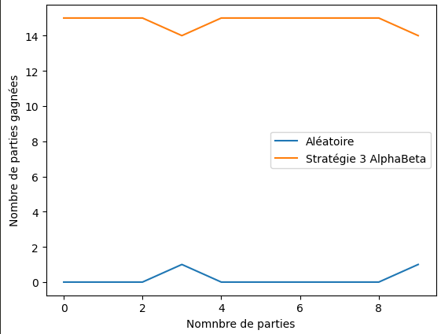
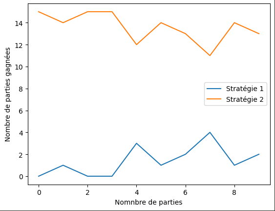
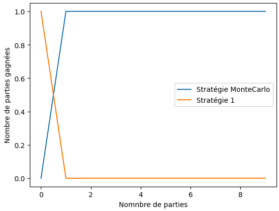

# Rapport de projet

## Groupe
* Anyes TAFOUGHALT
* Racha Nadine DJEGHALI

# projet-quoridor
    Projet IA et Jeux 2022-2023, L3 Sorbonne Université

# Sujet (Poroposé) :

Il nous est demandé dans ce projet d'implémenter différentes stratégies se basant sur differents algorithmes notamment  **MinMax**, **AlphaBeta** et **MonteCarlo** en plus des éventuelles stratégies auxquelles on aurait déja pensé.

## Principe du jeu :
Chaque joueur cherche à être le premier à traverser le terrain. Les joueurs jouent à tour de rôle. Les coups possibles sont:

* Le déplacement de son joueur,
* le dépôt d'un mur de 2 cases sur le plateau.

Les règles de déplacement sont les suivantes:

* Il est possible de se déplacer d'une case, dans toutes les directions sauf les diagonales. On suppose ici que les joueurs ne se bloquent pas entre eux, et qu'ils peuvent éventuellement être sur la même case à un moment donné.

Les règles de placement sont les suivantes:
* Les murs sont constitués de 2 "briques" (2 cases) qui doivent être posés côte-à-côte horizontalement ou verticalement
* les murs sont ici posés sur les cases (et non entre elles comme c'est le cas dans le jeu de Quridor classique),
* Il est interdit de poser des murs sur les cases où sont placés initialement les joueurs
* Il est interdit de déposer un mur à un endroit qui fermerait tout chemin d'un des autres joueurs vers ses objectifs.

## Description des choix importants d'implémentation: 

Pour ce faire :     
    Nous avons commencé par implementer des stratégies plutôt naives (hormis l'Aléatoire) qu'on a par la suite developpées.
    On a decider d'utilisé la même strategie tout au long d'une partie pour chaque joueur
1.  Nous avons pensé dans un premier lieu à une stratégie qui aiderait le joueur à choisir entre se déplacer et placer un mûr en se basant uniquement sur les distances qui séparent les joueurs de leurs objectifs.(**1ère strategie**)

2.  On s'est ensuite intéressé au reel intêret de placer un mur. En effet, on s'est demandé si le fait de se reposer uniquement sur la distance des joueurs par rapport à leurs objectifs était suffisante. Afin d'ameliorer cela nous verifions d'abord si le depot du mur bloquait reelement notre adversaire.(**2éme strategie**)

3. Deux  de nos autres stratégies se sont également basées sur des algorithmes trés connus qui nous ont été présentés en cours :
    * MinMax (**3éme strategie**)
    * Alpha Beta(**4éme strategie**)
4. La dernière stratégie s'est basée sur l'algorithme Monte-Carlo (**5éme strategie**) :
    
*  => Nous avons fait le choix de les utiliser afin de bien évaluer les consequence ou encore le gain du joueur  optant pour une action donnée . Ces approches sont considérées comme étant plus performantes que les autres car elles aident le joueur non seulement à choisir quelle action effectuer mais comment bien la réaliser (En choisissant une meilleure position de déplacement par exemple ou encore en sélèctionnant un des endroits les plus favorable au blocage de l'adversaire) .

### Fonctions auxiliaires :
Afin d'implementer nos différentes strategies nous avons utilisées quelques fonctions dont la description est données si dessous :
 * `draw_random_wall_location(joueur)` : 
    * Utilisé par la stratégie **aleatoire** . 
    * Prends en paramétre le joueur courant .
    * Tire au hasard une position ou le joueur pourrait placer un mur sans probleme (sans bloqué personnes definitivement ).
 * `draw_wall_location_strategie_1(joueur,Chemin_de_ladversaire)` : 
    * Utilisé par la stratégie **stategie1** . 
    * Prends en paramétre le joueur courant ainsi que le chemin retourné par A* pour l'adverseve qui le mènera vers son objectif .
    * Essaye de trouver une position sur laquelle poser un mûr, d'abord sur le chemin de l'adversaire(Afin de lui couper la route ) ensuite si cela n'est pas possible sur une autre position tirée aleatoirement (Elle retourne donc tout le temps une position possible).
 * `draw_wall_location_strategie_2(joueur,Chemin_de_ladversaire)` : 
    * Utilisé par la stratégie **stategie2** . 
    * Prends en paramétre le joueur courant ainsi que le chemin retourné par A* pour l'adverseve qui le mènera vers son objectif .
    * Essaye de trouver une position sur laquelle on peut placer un mûr uniquement sur le chemin de l'adversaire pour cette fois-ci(Afin de lui couper la route) sinon retourne *None*.
 * `choose_action_2(joueur,minMax,depth)` :
    * Utilisé par les stratégies **3** et **4** . 
    * Prends en paramétre le joueur courant, un booleen minMax mis a *True* lorsqu'on souhaite appeller l'algo MinMax ou alphaBeta lorque ce dernier est a *False*.
    * Cette fonction nous renvoie la meilleure manière de proceder :
        * "MOVE" accompagné des coordonnées de la case à laquelle le joueur va se deplacer .
        * "PLACE_WALL" accompagné des coordonnées des 2 cases où il faut placer le mur.
    * Cette fonction appelle les algorithme minMax ou alphaBeta selon la valeur du boolean et essaye a chaque fois de maximiser le coût retourner par ces 2 algorithmes (L'heuristique estimée pour une action donnée ).
 * `evaluation_function` :
    * C'est l'une des fonctions les plus **importantes**, celle-ci renvoie une valeur représentant le score ou le gain que peut rapporter une suite d'actions, Cette methode est appellée par les algorithmes alphaBeta et minMax pour evaluer le gain(dans une situation précise) du joueur à une profondeur donnée aprés avoir efféctué quelques actions données (Ou encore pour estimer a quel point un coup pourrait faire gagner le joueur)
    * Pour ce score on a choisi de maximiser selon des facteur qu'on pourrait ajuster :
        * La difference de taille entre le chemin de l'adversaire vers son objectis et le notre : dans le but d'essayer de le garder plus loin que son objectifs , en nous rapprochant du notre.
        * Le nombre de mûr qu'on posséde par rapport à l'autre joueur, afin de pouvoir surtout les utiliser un peu au milieu du jeu, et ne pas les déposer dés le depart (idée que nous avons estimée plus intelligente).
        * Le nombre de nos déplacements possibles en minimisant ceux du joueur adverse : dans le but d'essayer de le bloquer le maximum possible tout en evitant de se retrouver entouré de plusieurs obstacles aussi.
    * Si le joueur arrive a son objectif on retourne un score (le plus elevé)
    * Si le joueur adverse arrive a son objectif on retourne le pire score(le plus faible)
 * `minMax` :
    * Cette implementation se base sur la vraie version du minMax algoroithm ,L'algo prend en paramétre une profondeur ainsi qu'un autre paramétre d initialisé à  1 :
        * Si on atteint la profoneur specifiée (d == profondeur) on retourne un score en appellant `evaluation_function`.

        * Sinon :  Si d n'est pas mutliple de 2 on pocede pour le joueur MIN (adversaire donc):
            * suppose dans un premier lieu que le joueur adverse se deplace a la premiere case retournée par A* et evoque ensuite un appel recursif MinMax sur une profondeur incrementé.
            Et on prend le min entre notre score initiale et le score retourné par l'appel recursif , le joueur min ici essaye et fait de son mieux pour minimiser le gain.
            * Ensuite elle vérifie s'il reste au joueur adverse des mûrs à placer :
                * Si c'est le cas, elle appelle `draw_wall_location_strategie_2` pour lui retourner une postion sur le chemin du joueur courant et le place , et fait ensuite appelle recurssif a minMax en incrémentant le d: 
                    * Si le score est plus petit que celui qu'on a precedemment enregistré on sauvegarde l'action (postions du mur dans ce cas)
            * On retourne la valeur minimale enregistrée.
        * Sinon :
            * suppose dans un premier lieu que le joueur courant se déplace à la première case retournée par A* et évoque ensuite un appel recursif MinMax en incrémentant le d.
            Et on prend le max entre notre score initiale et le score retourné par l'appel recursif , le joueur max ici essaye de maximiser son propre gain.
            * Ensuite elle verifie s'il reste au joueur courant des mûrs à placer :
                * Si c'est le cas, elle appelle `draw_wall_location_strategie_2` pour lui retourner une postion sur le chemin de du joueur adverse et le place , et fait ensuite appel recursif a minMax en incrémentant le d: 
                    * Si le score est plus grand que celui qu'on a precedemment enregistré on sauvegarde l'action (postions du mur dans ce cas)
                * On retourne la valeur maximale enregistrée.
* `alpha_beta`:
    * Cette implementation se base sur la vraie version de AlphaBeta algoroithm ,L'algo prend en parametre une profondeur, paramétre d initialisé à  1 ainsi que 2 valeurs alpha et beta :
        * Si on atteint la profoneur specifiée on retourne un score en appellant `evaluation_function`.

        * Sinon, Si d n'est pas mutliple de 2 on pocede pour le joueur MIN (adversaire donc):
            * suppose dans un premier lieu que le joueur adverse se déplace à la premiere case retournée par A* et évoque ensuite un appel recursif MinMax sur un d incrementé.
                * Si la valeur retourner par l'appel recursif est plus petite ou egale a alpha on l'a renvoie .
                * Sinon on sauvegarde dans beta le min entre beta et le score retourné par l'appel recursif , le joueur min ici essaye et fait de son mieux pour minimiser le gain.
            * Ensuite elle verifie s'il reste au joueur adverse des murs a placer :
                * Si c'est le cas, elle appelle `draw_wall_location_strategie_2` pour lui retourner une postion sur le chemin de du joueur courant et le place , et fait ensuite appelle recurssif a minMax sur un d incrementée: 
                    * Si la valeur retourner par l'appel recursif est plus petite ou egale a alpha on l'a renvoie .
                    *  Sinon on sauvegarde dans beta le min entre beta et le score retourné par l'appel recursif , le joueur min ici essaye et fait de son mieux pour minimiser le gain.
        * Sinon :
            * suppose dans un premier lieu que le joueur courant se déplace a la premiere case retournée par A* et évoque ensuite un appel éecursif MinMax sur une profondeur incrementée.
                * Si la valeur retourner par l'appel récursif est plus grande ou égale à beta on l'a renvoie .
                * Sinon on sauvegarde dans alpha le max entre alpha et le score retourné par l'appel recursif , le joueur max ici essaye de maximiser son propre gain.
            * Ensuite elle verifie s'il reste au joueur courent des mûrs a placer :
                * Si c'est le cas, elle appelle `draw_wall_location_strategie_2` pour lui retourner une postion sur le chemin de du joueur adverse et le place , et fait ensuite appel recursif a minMax sur un d incrementée: 
                    * Si la valeur retourner par l'appel récursif est plus grande ou égale a beta on l'a renvoie .
                    * Sinon on sauvegarde dans alpha le max entre  alpha et le score retourné par l'appel recursif , le joueur max ici essaye de maximiser son propre gain.
                * On retourne la valeur maximale enregistrée.
* `choose_action_MonteCarlo` :
    *   Cette fonction est appellée par notre **stratégie5** qui se base sur l'algorithme *Monte Carlo*
    * Prends en parametre un joueur.
    * Cette fonction nous renvoie la meilleure maniere de proceder :
        * "MOVE" accompagné des coordonnées de la case à laquelle le joueur va se deplacer .
        * "PLACE_WALL" accompagné des coordonnées des coordonnées des 2 cases ou il faut placer le mur.
    * Elle appelle l'algorithme monteCarlo en supposant dans un premier temps que la situation correspond au deplecement du joueur , ensuite elle le rappelle en supposant que plutot que se deplacer le joueur place un mur afin de comparer ce 2 éme score aux precedantes valeurs enregistrées et en garder la plus grande .     

 *  `MonteCarlo`:
    * C'est une imlémentation dans laquelle on fait 50 simulations de parties aleatoires a partir de la siutation actuelle , et on recupére l'heristique de chaque simmulation (chaque noeud) pour les sommer et les retourner par la suite.

 *  `simulation_2`:
    * Dans cette fonction on se contente de simuler une suite de 4 coups aleatoires pour le joueur, afin de pouvoir ensuite evaluer son heuristique dans la fonction appellante qui est donc *MonteCarlo*.
    
## Description des stratégies proposées: 

* 1. Aléatoire :
     * Dans cette stratégie chacun des deux joueurs vérifie s'il pocéde encore des mûrs à placer , il tire une valeur aléatoire selon laquelle il décide soit de placer un mûr ou plutôt de se déplacer :
        * Pour placer un obstacle  = > il le fait de manière totalemnt aléatoire.
    Sinon  il se déplace à la premiére case du chemin retourné par A*.
* 2. Stratégie_1 :
     * Ici , pour choisir entre se déplacer ou poser un mûr , le joueur compare la longeur de son chemin vers son objectif(retourné par A*) à celui de son adversaire :
        * S'il est plus loin :
            * Il **decide** de placer un mur a tout prix, en appellant `draw_wall_location_strategie_1` qui lui retournera une position soit sur le chemin de son adversaire ou dans un endroit quelconque sur le plateau .
        * Sinon il se deplace à la premiere case du chemin vers sa victoire retourné par A*.
* 3. Stratégie_2 :
     * Cette stratégie est une amélioration de la precedente, le joueur compare la longeur de son chemin vers son objectif(retourné par A*) a celui de son adversaire :
        * S'il est plus loin :
            * Il **essaye** de placer un mûr sur le chemin de son adversaire en évoquant `draw_wall_location_strategie_2` qui lui retournera une position sur le chemin de son adversaire ou None.
        * Sinon s'il est plus loin mais qu'il n'arrive pas à placer de mûr pour couper la route à l'autre joueur il se déplace toujurs à la premiere case du chemin vert sa victoire retourné par A*.
* 4. Stratégie_3 (MinMax) et Stratégie_3 (AlphaBeta) :
     * Dans ces 2 stratégise, on utilise le minMax ou alphaBeta(Selon le boolean minMax). En effet , pour savoir quelle option choisir le joueur appelle choose_action_2 avec le boolean mis à True pour minMax, et à False pour alphaBeta .
     * La fonction choose_action_2 :
        * suppose dans un premier lieu que le joueur se deplace à la premiere case retournée par A* et evoque ensuite MinMax/AlphaBeta sur cette situation du plateau, et celui-ci va lui retourner un score.
        
        * Ensuite elle verifie s'il reste au joueur des mûrs à placer :
            * Si c'est le cas, elle appelle `draw_wall_location_strategie_2` pour lui retourner une postion sur le chemin de l'adversaire et le place , et fait ensuite appelle a minMax/AlphaBeta sur cette autre configuration du plateau possible : 
                * Si le score est plus grand que celui retourner apres déplacement du joueur on opte pour cette 2 éme démarche sinon on reste sur la premiere (deplacemment du joueur).
     * Selon donc ce qui a été retourné par choose_action_2 on deplace le joueur vers la case retournée , ou on construit un mÛr sur les cases choisies.
* 5. Stratégie_5 :
     * Dans cette strategie on utilise le Monte Carlo. En effet ,en evoquant `choose_action_MonteCarlo`: 
     * La fonction `choose_action_MonteCarlo` :
        * suppose dans un premier lieu que le joueur se deplace a la premiere case retournée par A* et evoque ensuite `MonteCarlo` sur cette situation du plateau, et celui -ci va lui retourner un score.
        
        * Ensuite elle verifie s'il reste au joueur des murs a placer :
            * Si c'est le cas, elle appelle `draw_wall_location_strategie_2` pour lui retourner une postion sur le chemin de l'adversaire et le place , et fait ensuite appelle a `MonteCarlo` sur cette autre configuration du plateau possible : 
                * Si le score est plus grand que celui retourner apres deplacement du joueur on opte pour cette 2 éme demarche sinon on reste sur la premiere (deplacemment du joueur).
     * Selon donc ce qui a été retourné par `choose_action_MonteCarlo`on deplace le joueur vers la case retournée , ou on construit un mur sur les cases choisies.
     * On a decidé ici de prendre la valeur maximale car ça represente une direction qui va diriger le joueur vers des noeuds ou encore situations ou l'heurisitique est plus elevée et donc favorable.
## Description des résultats
Afin d'évaluer les performances des différentes stratégies, nous avons générer 10 fois 15 parties sur 2 stratégies différentes à parir des quelles on a tracé les graphes suivants :

* La stratégie 1 est plus performante que la stratégie aléatoire.

* La stratégie 2  pest plus erformante que la stratégie aléatoire.

* La stratégie 3 avec MinMax est plus performante que la stratégie aléatoire.

* La stratégie 3 avec AlphaBeta est plus performante que la stratégie aléatoire.

* La stratégie 2 est plus performante que la stratégie 1.

* La stratégie 3 avec MinMax est plus performante que la stratégie 1.

* La stratégie 3 avec AlphaBeta est plus performante que la stratégie 1.

* La stratégie 3 avec MinMax est plus performante que la stratégie 2.

* La stratégie 3 avec AlphaBeta est plus performante que la stratégie 2.

* D'aprés ce graphe on remarque qu'en moyenne la stratégie 3 avec l'algorithme Alphabeta gagne 51% contre MinMax, et cela quand c'est le joueur avec MinMax qui commence.

* En revanche, si c'est le joueur,de la stratégie 3 avec AlphaBeta, qui commence, on a constaté que ce dernier gagne en moyene 49%.

* Monte-Carlo est plus performante que la stratégie aléatoire.

* Monte-Carlo est plus performante que la stratégie 1.

* Monte-Carlo est plus performante que la stratégie 2.

* Notre stratégie MinMax est plus performante que la  MonteCarlo.

## Conclusion génèral :
D'aprés toutes ces statistiques, on peut conclure que :
* La stratégie aléatoire est la moins performante par rapport à toutes les autres stratégies.
* La stratégie 1 est plus performante que la stratégie aléatoire et moins performantes que les autres.
* La stratégie 2 est plus performante que la stratégie aléatoire et la stratégie 1. En revanche, elle est moins performantes que les autres.
* La stratégie 3 avec MinMax est plus performante que la stratégie aléatoire, la stratégie 1, la stratégie 2 et Monte-Carlo.
* La stratégie 3 avec AlphaBeta est plus performante que la stratégie aléatoire, la stratégie 1 et la stratégie 2.
* En moyenne les deux stratégies avec MinMax et AplhaBeta ont les mêmes performances.

* La stratégie avec l'algorithme de monte-carlo est plus performante par rapport à la stratégie aléatoire, la stratégie 1 et la stratégie 2.

==> Stratégie aléatoire << Stratégie 1 < Stratégie 2 < Monte-Carlo < MinMax et AlphaBeta